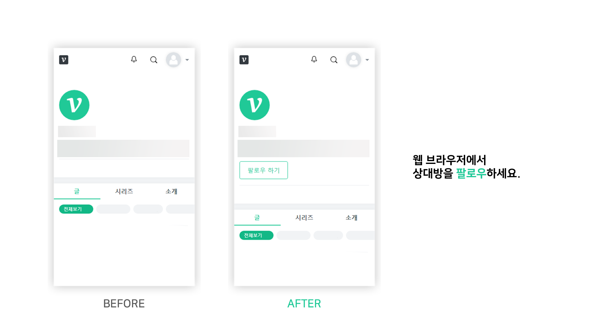
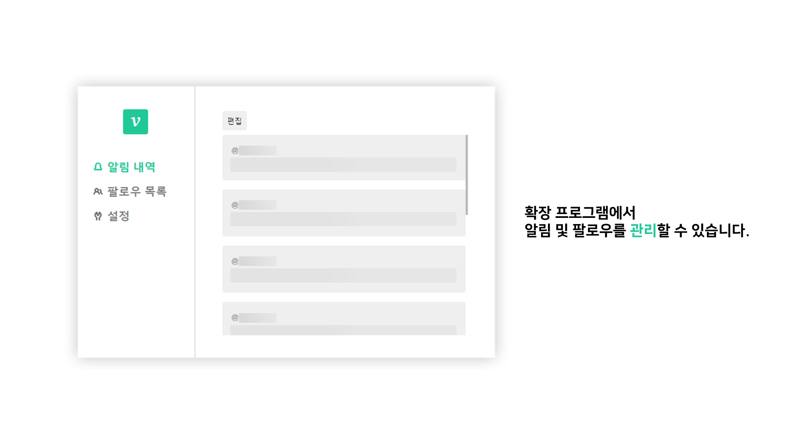
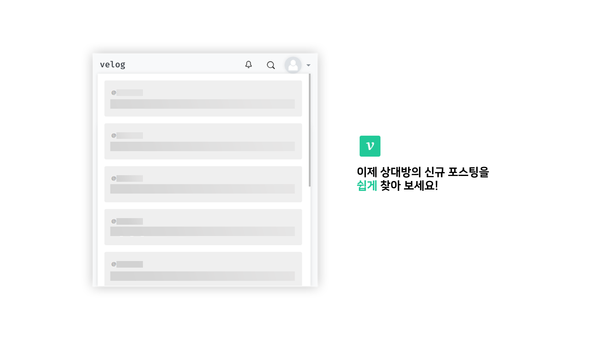
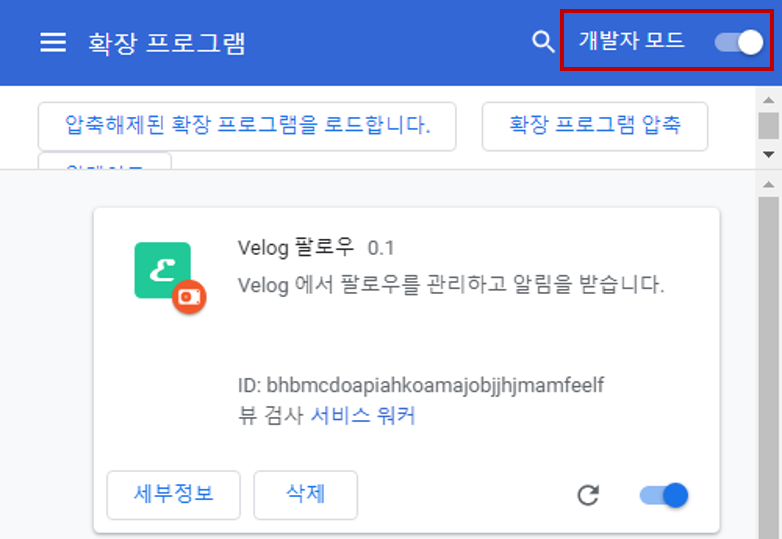
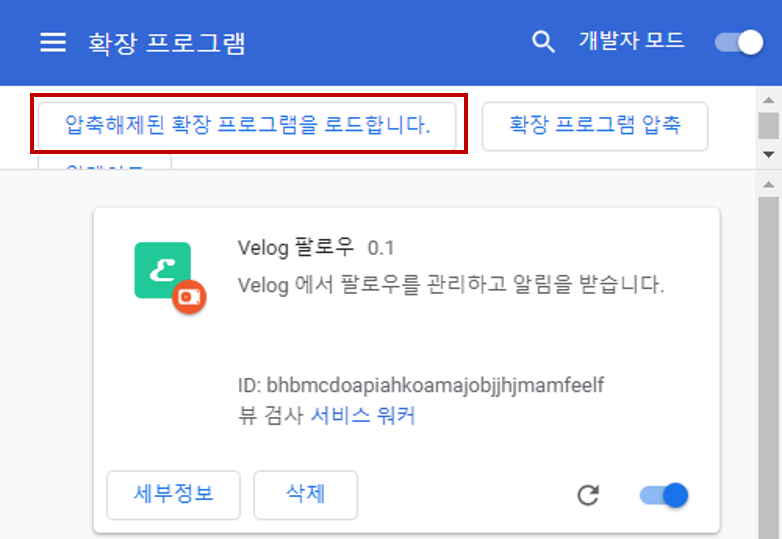

 
 

  

 

  <strong>velog</strong> 확장 프로그램
   

 
 

 
 

## 설치법

[chrome://extensions/](chrome://extensions/)로 접근하여 개발자 모드로 변경합니다.

`압축해제된 확장 프로그램을 로드합니다`를 클릭합니다.

[최신 릴리즈](https://github.com/kyechan99/velog-extension/releases) 파일을 다운받고 해당 폴더를 지목합니다.

